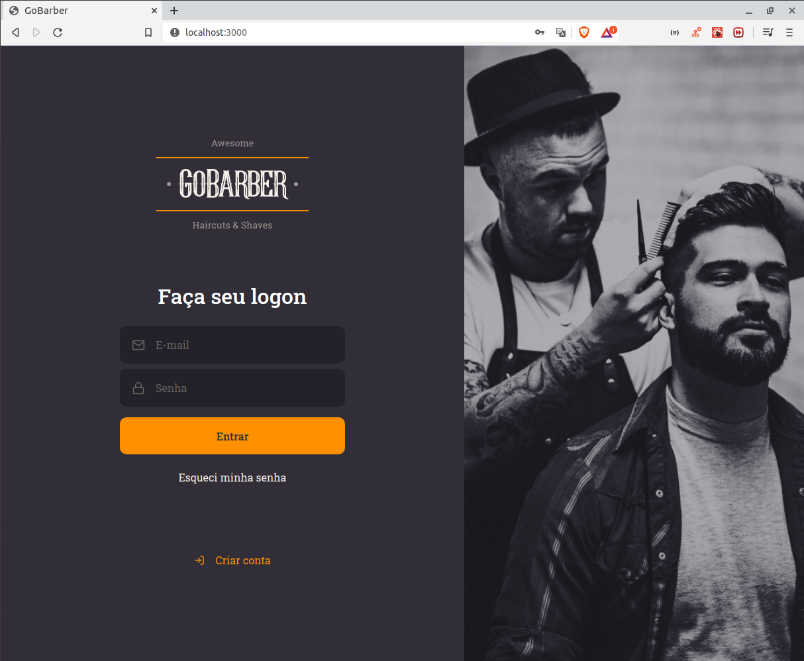
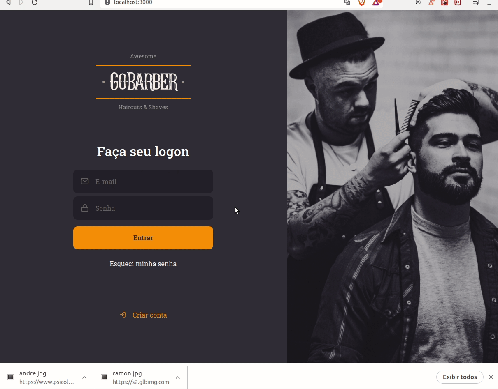

# GoBarberApplication

## Sumary
[Intro](#intro) :door:  
[How it works](#how-it-works) :open_book:  
[How can I use ?](#how-can-i-use-) :open_book:  
- [Steps](#steps) :open_book:  

## Intro

GoBarber is a application to schedule an appointment with a hair stylist, and the hair stylist can see the appointments with his client

- Node.js for back-end;
- React.js for front-end;
- React Native for mobile.

## How it works
In the website of the application, you can register an account, receive and email if you forgot the password, see your perfil, change your photo, and some another's informations of your profile

And in the mobile, you can see the appointments that your clients schedule with you, and you can schedule any appointment with another hair stylist

## How can I use ?

You will need to have Node.js to run
Postgres, mongodb, redis

### Steps

git clone https://github.com/MarcusMartins38/GoBarberApplication.git  
  or 
git clone git@github.com:MarcusMartins38/GoBarberApplication.git

yarn (Maybe you need to enter each folder and run this command)

cd backend

yarn dev:server

(Now you can run, yarn start in frontend and in the appgobarber, that is the mobile).

